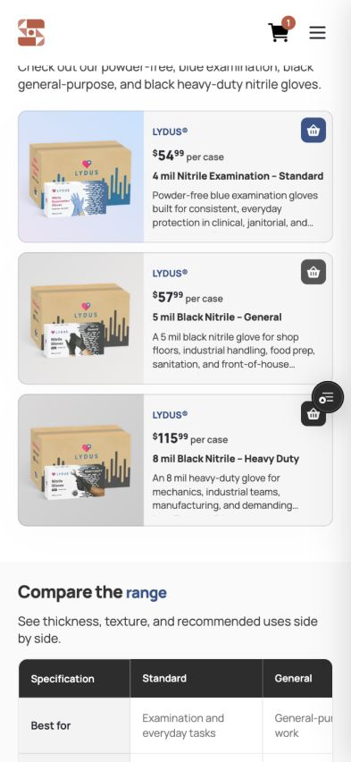
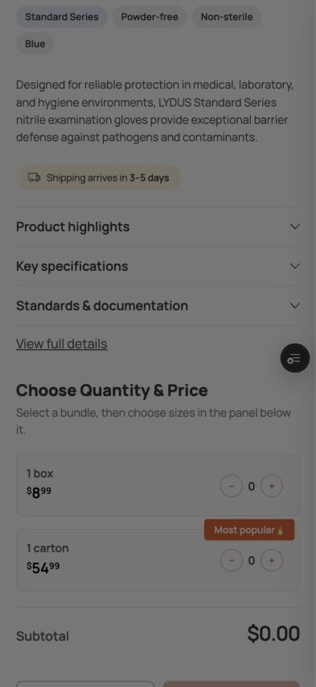
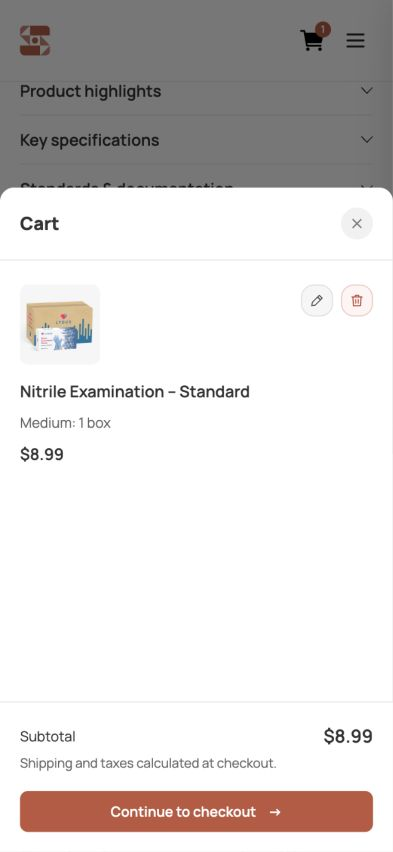
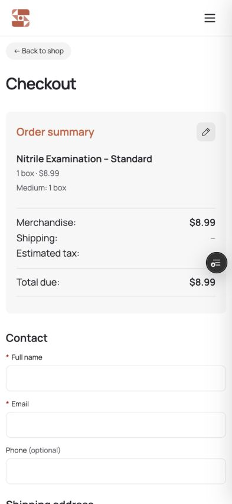
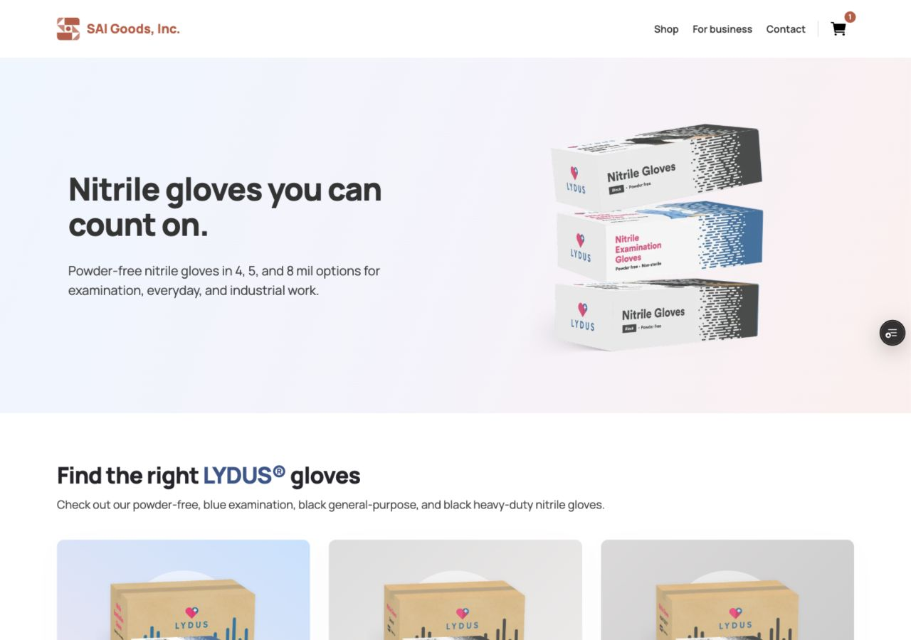
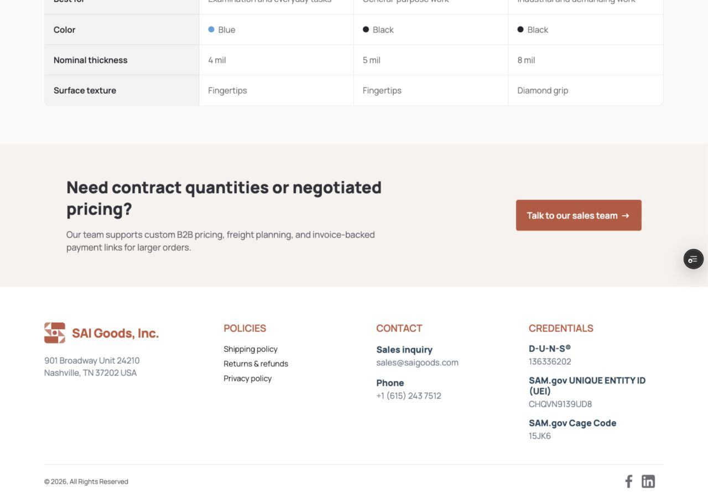
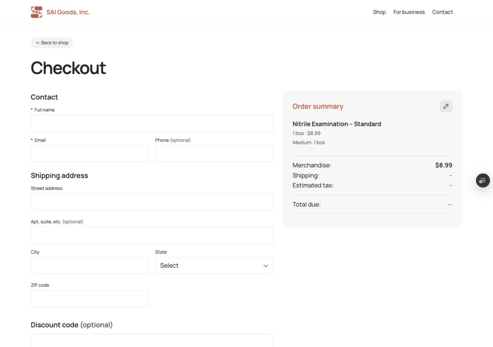

# Storefront UI release review

Draft review, September 18, 2026. Production publication is not authorized.

## Scope

Responsive homepage and product cards, shared header/footer, product details sheets, mobile mini-cart, bundle/size selection, and checkout presentation. Storefront offer display and SEO use runtime pricing. Payment, shipping, database runtime, and Square webhook implementations match main at `dfa4ca8cf81f787af78923616b2db5a0e59348dc`.

Sandbox schema/isolation scripts, local checkout simulator, and Sandbox webhook changes are excluded. Automatic Vercel deployment is disabled for `codex/storefront-ui-release` because this review branch has no isolated environment overrides. Do not remove this guard or promote the branch without a separate deployment review.

## Validation

- Exact release worktree: SEO suite passed; cart/bundle/checkout-entry tests 12 passed; shipping verification 123 passed.
- Browser review: 393×852 mobile and 1280×900 desktop. Homepage and checkout had no horizontal document overflow. Product details and mini-cart displayed correctly; close controls and cart-to-checkout navigation worked.
- One temporary browser cart item was added and removed; no payment was submitted during this review.
- Screenshots below are from the isolated renovation Sandbox Preview at source `8ee2e6e3b01a0592d544d781da9575608f899563`. They show the shared UI, not a deployment of the stripped release branch. Release source was tested locally.
- Viewport captures are used because full-page capture produced stitching artifacts.

## Remaining before release

- Verify touch drag dismissal for both sheets on a physical phone. A mouse-driven drag attempt did not dismiss the details sheet; touch behavior is not certified by this review.
- Review supplied black-glove specifications, size wording, food-contact claim, and existing allergy-related artwork.
- Reconcile product-modal shipping/returns wording with published policies.
- Complete final approval of the exact release build before any production merge or deployment.

## Screenshots

